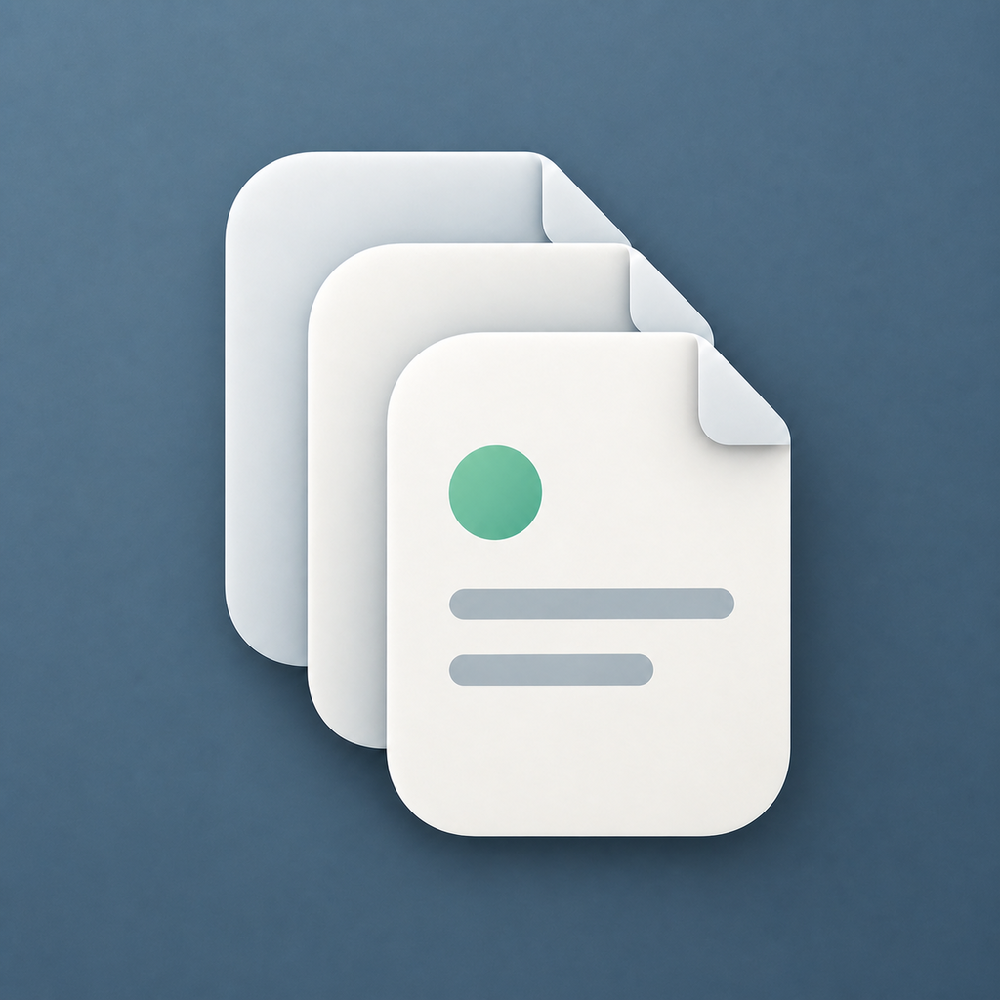

<div align="center">
  
  <h1>Folio SVN</h1>
  <p><strong>把企业 SVN 文档库变成更像 Finder 的 macOS 客户端。</strong></p>
  <p>弱化 Working Copy、Branch 和 Merge，专注文件浏览、传输、历史和日常文档协作。</p>

  <p>
    <a href="https://github.com/yichengchen/FolioSVN/actions/workflows/ci.yml"></a>
    <a href="https://github.com/yichengchen/FolioSVN/releases/latest"></a>
    
    
    
  </p>

  <p>
    <a href="https://github.com/yichengchen/FolioSVN/releases/latest"><strong>下载最新版本</strong></a>
    · <a href="docs/README.md">产品与技术文档</a>
    · <a href="https://github.com/yichengchen/FolioSVN/issues">问题反馈</a>
  </p>
</div>

> [!IMPORTANT]
> Folio SVN 目前仍是 `0.x` 预览版，仅支持 macOS 26+ 和 Apple Silicon。建议先在测试仓库验证工作流，再用于重要文档。

## 为什么做 Folio SVN？

很多团队已经用 SVN 存放合同、制度、项目资料和 Office 文档多年，但普通用户并不需要一套面向代码开发的版本控制界面。

Folio SVN 把 SVN 当作可追溯的文档后端：用户看到的是目录、文件、收藏和历史版本；底层仍保留 SVN revision、提交记录和重命名历史。

| 使用场景 | Folio SVN 提供的体验 |
| --- | --- |
| 日常找文件 | 目录树、面包屑、就地展开、收藏和文件名搜索 |
| 更新文档 | 上传、替换、重命名、删除和提交说明，不暴露 Working Copy |
| 找回旧版 | 查看历史、下载或打开指定 revision，将旧内容恢复为一次新提交 |
| 对比 Word 文档 | 对比两个 `.doc` / `.docx` 历史版本，或将历史版本与本地文件对比 |
| 企业内网仓库 | 账号写入 Keychain，可针对单个服务器选择自签名 HTTPS 证书策略 |
| 长期本地编辑 | 将仓库目录检出为独立 Working Copy，在 Finder 或其他应用中直接编辑并查看本地 SVN 状态 |

## 核心能力

### Finder 式浏览

- 目录树、面包屑、前进/后退、排序和按需加载。
- 文件列表可就地展开文件夹，也可双击进入目录。
- `⌘` / `⇧` 多选、Return 重命名、Space 快速查看、`⌘O` 打开、`⌘S` 下载。
- 支持从 Finder 拖入文件或文件夹递归上传，也可将仓库文件或目录拖到 Finder 下载。

### 文件操作

- 文件与文件夹上传、替换、新建文件夹、SVN move 重命名和批量删除。
- 打开的文件使用受管本地副本；可检测外部编辑、上传修改或放弃修改。
- 替换和恢复会校验远端 revision，避免静默覆盖其他人的新版本。
- 批量下载、删除和收藏；传输菜单可查看阶段和错误。下载支持取消与失败重试，写入任务可在明确提示“提交状态可能未知”后强制停止。

### 历史与检索

- 查看最近 100 条文件历史，包含 revision、修改人、时间和提交说明。
- 下载、打开或恢复任意历史版本；恢复动作本身会生成新 revision。
- 当前目录及其子目录的文件名搜索，搜索索引与 25 分钟 TTL 目录缓存复用。
- 收藏仓库文件或目录，可为收藏设置仅本机可见的显示名称。

### Working Copy（M1）

- 可从当前仓库目录或文件夹右键菜单执行完整 Checkout，任务支持取消并自动清理临时目录。
- 工作副本独立显示在侧边栏，本地文件使用 Finder 风格树形列表，不与远端目录缓存混用。
- 使用 `svn status --xml` 展示修改、新增、未纳管、删除、丢失和冲突等本地状态。
- 打开文件时直接使用工作副本路径；切换工作副本、App 回到前台或手动刷新时重新校准状态。
- 工作副本移动后可以重新定位；移除侧边栏记录不会删除任何本地文件。

### 兼容性与安全

- 内置可重定位的 Apache Subversion 1.14.5 arm64 Runtime，终端用户无需安装 Homebrew 或 SVN。
- 支持 `http://`、`https://`、`svn://`、`svn+ssh://` 和用于开发测试的 `file://` 仓库地址。
- HTTPS 默认严格校验；自签名/未知 CA 例外只作用于用户明确配置的单个服务器。
- 密码仅保存在 macOS Keychain；SVN 命令通过参数数组执行，不拼接 shell 命令。
- 不包含遥测、诊断上传或自动更新服务。

## 下载与安装

1. 打开 [Releases](https://github.com/yichengchen/FolioSVN/releases/latest) 并下载最新的 `FolioSVN-v*.dmg`。
2. 打开 DMG，将 **Folio SVN** 拖入 **Applications**。
3. 首次启动后添加 SVN 地址、用户名和密码；可在保存前单独测试连接。

GitHub Release 工作流会对应用和 DMG 执行 Developer ID 签名、Apple 公证与 staple 验证。发布包已包含 SVN 及 Word 差异运行时，使用者不需要另行安装 SVN、.NET、Java 或 Microsoft Word。

## 当前边界

- 只支持 Apple Silicon (`arm64`) 和 macOS 26+。
- 文件夹会作为一个完整项目递归上传；同名远端文件夹不会自动合并，需要先重命名或移除冲突项。
- 搜索仅匹配文件名，不解析 Word、PDF 或其他文档正文。
- Word HTML 预览用于展示文本变更，不是高保真排版渲染器；图片、分页、编号和仅格式变更可能不显示，旧版 `.doc` 仅提取正文文本参与比较。
- 不提供分支、标签、合并、冲突编辑器或独立回收站。
- Working Copy 当前只包含 Checkout、本地浏览和状态跟踪；Update、Commit、Revert 与冲突处理仍在后续里程碑中。
- Working Copy M1 不使用文件系统实时监听；App 保持前台时，可通过刷新按钮获取外部程序产生的新变更。
- 不支持自动更新；请通过 GitHub Releases 获取新版本。

## 从源码构建

### 环境要求

- macOS 26+
- Xcode 26.6+
- Swift 6
- [XcodeGen](https://github.com/yonaskolb/XcodeGen) 2.46+
- .NET SDK 10.0.401（仅用于生成自包含的 Word 差异运行时）

### 生成工程

```bash
git clone https://github.com/yichengchen/FolioSVN.git
cd FolioSVN

Scripts/package-worddiff-runtime.sh
xcodegen generate
open SVNClient.xcodeproj
```

`SVNClient.xcodeproj` 会纳入版本控制。修改 `project.yml` 或新增源文件后，请重新执行 `xcodegen generate` 并一并提交工程变更。

### 构建与测试

```bash
xcodebuild \
  -project SVNClient.xcodeproj \
  -scheme SVNClient \
  -configuration Debug \
  -destination 'platform=macOS,arch=arm64' \
  CODE_SIGNING_ALLOWED=NO \
  CODE_SIGNING_REQUIRED=NO \
  build

xcodebuild \
  -project SVNClient.xcodeproj \
  -scheme SVNClient \
  -destination 'platform=macOS,arch=arm64' \
  CODE_SIGNING_ALLOWED=NO \
  CODE_SIGNING_REQUIRED=NO \
  test
```

CI 使用 macOS 26 arm64 runner，会生成 Word 差异运行时、验证内置 SVN Runtime 及 XcodeGen 工程一致性，然后执行 Debug 测试和无签名 Release 构建。

## 项目结构

```text
Sources/SVNClient/
├── App/              # 应用入口、窗口与 Coordinator
├── Application/      # 仓库会话、元数据与业务服务
├── Domain/           # 稳定领域模型
├── Infrastructure/   # SVN CLI、GRDB、Keychain 与 Word diff
└── Presentation/     # AppKit 界面

Tests/SVNClientTests/       # 单元测试与真实本地 SVN 仓库集成测试
Tools/WordDiffDemo/         # 自包含 Word 差异 helper
Vendor/SVNRuntime/          # 内置 SVN Runtime、校验和第三方许可证
docs/                       # 产品、交互、技术、依赖与发布文档
```

## 技术栈

| 领域 | 实现 |
| --- | --- |
| 界面 | AppKit + SnapKit |
| 并发 | Swift Concurrency + actor + `@MainActor` View Model |
| SVN | 内置 Apache Subversion CLI，参数化调用与 XML 输出 |
| 结构化解析 | XMLCoder |
| 本地元数据 | GRDB.swift + SQLite |
| 凭据 | KeychainAccess + macOS Keychain |
| Word 差异 | 自包含 .NET helper + Open XML PowerTools / NPOI HWPF |
| 工程生成 | XcodeGen |

完整的产品边界、架构决策和开源依赖说明见 [`docs/`](docs/README.md)。

## 贡献

Issue 和 Pull Request 都欢迎。提交前请：

1. 使用尽可能小且聚焦的改动，说明用户问题和验证方式。
2. 为行为变更增加或更新测试。
3. 修改 `project.yml` 或源文件列表后重新生成 Xcode 工程。
4. 运行上述 `xcodebuild test`，并确认没有提交凭据、仓库地址或用户文档。

计划中的近期工作包括 Working Copy 的 Add/Revert/Update/Commit、权限错误体验和可脱敏导出的诊断日志。
